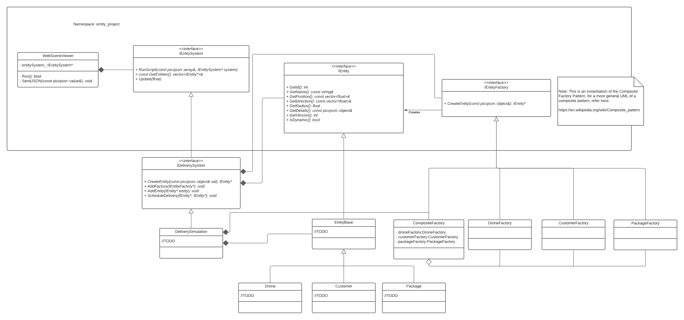

# Iteration One: Proof of Concept/Protoype -- Package Delivery System

## Iteration 1 - VERSION 4, March 8th -- Relaxed unit testing requirements from "all public methods" to "all public methods which do not overly rely on external classes".

## Iteration 1 - VERSION 3, March 4th -- Clarified the overall goal of the simulation in the introduction. 

## Iteration 1 - VERSION 2, March 3rd -- Changed IEntity.h to Entity.h 

## Iteration 1 - VERSION 1, February 19th  - **NOTE, THE REQUIREMENTS IN THIS DOCUMENT ARE SUBJECT TO CHANGE. THERE WILL BE A CANVAS ANNOUNCEMENT WHEN THERE IS A CHANGE TO THIS DOCUMENT.**

| Date | Item | Description of Verification and Validation of Deliverable(s) |
|:----:|:-----|:------------|
| FRI, March 5th, 11:55pm | UML diagram of your proposed solution for iteration One  | inspection |
| FRI, March 12th, 11:55pm | Preliminary Google Tests for 'Drone', 'Customer', 'Package', 'Vector3D', 'Battery', and 'Vector2D' | Pass automated tests and inspection |
| FRI, March 19th, 11:55pm | Documentation and Code Implementation | Automated tests and inspection |

## Project Introduction

For this project you will be creating a package delivery simulation. Amazon, FedEx, UPS, and other delivery services companies are developing automated delivery systems using drones, robots, and self-driving trucks. For this iteration of the project you will be creating just the drone package delivery system. **Your overall goal is for the drone to pick up the package and deliver it to the customer.** In this process you will have to create the following classes: Customer, Drone, Package, Vector3D, Vector2D, and a Battery class. To assist you in completing your solution we have provided you support code so the simulation runs in a web browser, firefox, chrome, etc. 

As part of the solution you will be using the facade design pattern (https://www.dofactory.com/net/facade-design-pattern) where the complexity of the system is hidden behind an interface. We will be giving you a Doxygen generated html file containing the documentation of all the classes being implemented behind the facade. **Do not modify the class IDeliverySystem or IEntity**

Your completed project deliverables should demonstrate good software design and development practices using good design methodologies, and rigorously follow the process for using version control you learned in lab 10

Intermediate deadlines are designed to keep you on  track in the iterative development process you are using to develop iteration 1 and the rest of the project this semester. 

For this iteration you will be submitting the following deliverables  based upon the timetable specified above. Below is the order of submission:

### First Deliverable

>Create a UML class diagram of your solution to Iteration One. Use https://cppcodetips.wordpress.com/2013/12/23/uml-class-diagram-explained-with-c-samples/ as a guide to developing your UML.

### Second Deliverable

>Create the classes for 'Drone', 'Customer', 'Package', 'Battery', 'Vector3D', and 'Vector2D'. Also create the Google Unit tests for these classes 'Drone', 'Package', 'Customer', 'Battery', Vector3D, and 'Vector2D'.  See the assessment section below and the Iteration 1, Deliverable 2 item on you class Canvas site for details. 

### Third Deliverable

1. Design and implement a composite factory capable of creating customers, packages, and drones. There will be a lab to assist you in your development.

2. Update your UML diagram to include any changes made to your original UML document from the first deliverable.

3. In your Doxygen mainpage, create a user guide that tutors a new user, with your level of experience, on  obtaining, configuring, compiling, and running the simulation, and discuss the alternate design choices you considered for your factories. Your discussion should include  at least one pro and con of each design, and why you chose to implement the design you implemented. 

4. Ensure all classes in the `project/src` directory are properly documented **(All header functions document the classes and their methods using Doxygen, and all implementation (that is, \*.cc) files have self-documenting code).**

5. Correct and update the first UML diagram you delivered to include changes to your code including your factory class(es) and their relationships to the classes that already existed in the simulation. 

***6. The drone delivers a package to the customer.***

## Deliverables and Submission Process

>You will submit all your deliverables via GitHub according to the process specified lab 10. We will tag and pull your repository at the specified due dates and grade them according to the contents at that time.

>#### You must verify that your submission compiles on a cselabs machine and it is complete. You will receive zero or be heavily penalized if your code does not compile and/or we cannot generate documentation using Doxygen as specified in Lab 8 upon submission.

The schedule is very tight, and it is important that you keep up with the project. The project will continue to build throughout the semester, and if you get behind, it will be very difficult to catch up. For this reason, **late assignments will will receive the following penalities: 1 day late -- 10% deduction, 2 days late -- 20% deduction. A day is defined as a regular day of the week, thus if your submission is due on Friday at 11:55 PM and it is submitted on Saturday it is one day late. Submissions after two days will not be accepted**, but you will receive partial credit for partial completion of the requirements - so **ALWAYS MAKE SURE TO SUBMIT SOMETHING - SOME POINTS ARE BETTER THAN NONE**.

You can convert this requirements document to pdf using this tool: http://www.markdowntopdf.com/

## Documentation and Code Implementation Requirements

### Overview

The goal of this software project is to produce a package delivery system in which the simulation can be controlled via external configuration (without code change) and be visualized on a web browser. 

In this iteration, you do the following development including:

- writing classes to represent the entities
- formulating unit tests with Google Test
- adding to the simulation class structure 
- ensuring style guide compliance
- create design documentation using UML
- using Doxygen to document and generate documentation
- Use git, and produce self-documenting code (i.e. good organization and naming conventions). 

Teaching staff (Undergraduate TA's, Graduate TA's, and Instructors)  will also be working diligently to provide the structure and support for development, testing, and documentation. Automation in unit testing, style compliance, in-house github testing, and documentation will make this an easier process, however it means that you will have to develop within the constraints of these systems. **Often there is a learning curve and a lot of systems trouble-shooting to get it all working, so start early!**

In the first iteration, you will be adding classes to our support code to enhance the simulation by designing and implementing the items listed above. Since this a proof of concept, **your simulation should use a single drone to deliver a single package to a customer.** The simulation is using three.js to create a 3D model of the University of Minnesota campus. Later we will be adding more scenes, drones, packages, etc. Therefore your solution to iteration one should be robust. **The drone has to detect the package, pick up the package, and deliver it to the customer. Once the package is delivered it should be removed from the simulation.** 

Iterations 2 and 3 will include more changes, enhancements/extensions, and put the core functionality to greater use. 

### Functional Requirements

You are being provided with a significant initial code base. The first iteration is focused on building classes and getting practiced in the software development process. It is also a drop into the depths of C++ syntax. The support-code will not be provided to you. You will have to interact with our code via the Facade. Please ask questions. We do not expect you to understand all the constructs in this code. Below is an outline of the existing functionality.

The code is organized such that simulation behavior (i.e. the model) is separate from visualization (i.e. the view), which allows for automated unit testing using Google Test. In addition, there have been a few entities which have been made into abstractions to allow for extension (and for grading). The  primary driver of the visual simulation is you, the user, via the simulation graphics panel (which displays the 3D U of M campus and a user interface).  The code that drives the simulation can be found in the JavaScript file `three.js` located in the directory `project/web`. **There is no need for you to change this file for this project.** 

The *main function* (in the file *main.cc* **DO NOT CHANGE**) and the *IEntitySystem* class are used to configure the package delivery simulation and facilitate communication via the simulation your classes (found in the `project/src` directory) and the graphical user interface displayed on a web page via the *WebSceneViewer* class. The IentitySystem and WebSceneViewer are complex classes that will interact with the facade classes. 

**REQUIREMENTS you need to fulfill**

> This is just functionality. Along the way, make sure to document the code using Doxygen syntax in the header files, and self documenting code (as discussed in McConnell's text in Chapter 32) in your class implementation (\*.cc) files. and the main function.  

Below is a prioritized list of enhancements to our support code to make the simulation realistic. **Complete all functionality in one priority level before moving on to the next.** In this way, if we run out of time, the low priority items will be dropped from the requirements.

#### General understanding

Packages, Customers, and Drones are added to the simulation by two methods found in the IDeliverySystem class: CreateEntity and AddEntity. The prototype of the CreateEntity method is; IEntity * CreateEntity(const picojson::object &val); 

We have created json_helper class to assist you in creating/using the appropriate picojson object. This is needed so the appropriate entity appears. We have created a file called umn.json that contains the following default json structures for drones, packages, and customers. An example of the contents of this file is below:

#### Drone

>{ “type”: “drone”, “name”: “drone”, “position”: [0,0,0], “direction”: [1,0,0], “speed”: 1.0, “radius”: 1.0 }

#### Package

>{ “type”: “package”, “name”: “package”, “position”: [0,0,0], “direction”: [1,0,0], “radius”: 1.0 }

#### Customer

>{ “type”: “customer”, “name”: “customer”, “position”: [0,0,0], “direction”: [1,0,0], “radius”: 1.0 }

This is a three dimensional simulation, therefore all positions in the simulation will be on the x, y, z plane. In addition, you will have to use Eulerian integration (See: https://gafferongames.com/post/integration_basics/ for more information.) In addition, unit vectors will also be needed. Recommend that you review vector math. 

**Overview of the process**

Implementation in the prototype phase is important for developing a proof of concept.   Here is an overview of what we are proposing:

1. When the application is run, the visualization loads and starts the simulation.  This should be available with the base code.

2. Entities are created based on the 'CreateEntity(...)' method within the facade.  This includes all 'drones', 'packages', and 'customers'.

3. The created entities are added to the system within the 'AddEntity(...)' method within the facade.

4. Once entities are added, they are updated with each time delta dt inside the 'Update(float dt)' method within the facade. This means drones and packages move within this function.

5. Packages are scheduled for delivery within the 'ScheduleDelivery(...)' method within the facade.  Once scheduled, drones can pick up packages and deliver them from the source customer to the destination customer.  The package moves with the drone.

#### Priority Level 1 : Create a UML design for your iteration one solution. Follow these guidelines: https://cppcodetips.wordpress.com/2013/12/23/uml-class-diagram-explained-with-c-samples/ when completing your UML.

##### Priority Level 2: Create the following classes and the associated Google Tests

**Vector3D**

Should contain all of the methods necessary to perform 3D Vector Math. I.e. normalize, magnitude, etc. Should also contain (x, y, z) coordinates. This will be used for all entities that have three dimensional movement capabilities.

**Vector2D**

Should contain all ofthe methods necessary to perform 2D Vector Math. Contains (x,0, z) coordinates. This will be used for all entities that cannot fly.

The following classes should inherit from the abstract class IEntity.

**Drone**

Override all of the methods in the IEntity class. Drones can do beeline deliveries or they can follow a smart route which we have created using the A* algorithm for finding shortest path. 

The drone should have the following functionality:

1. Drones should be able to move from point A to point B at a constant speed.  You can use the following formula for calculating movement for the prototype:
>Pseudocode: position = position + direction \*speed \*dt 
>Note: position and direction are stored in the IEntity class interface in Entity.h.

2. When a package is scheduled for delivery, a drone should navigate to the package, pick up the package, and bring it to its destination.  The drone should follow the route from the source to the destination based on a beeline path or one of our default routes. The drone should never exceed the constant speed for this iteration.

3. When a drone’s radius is within the radius of the package it will pick it up.  When a drone’s radius is within the radius of a destination customer, it will drop off the package.

All drones have a battery (Battery class Why? Because in iteration 2 we are expanding the delivery system to include robots and delivery trucks which require different types of batteries.), should also have an attribute that indicates it is moving, and an attribute containing the route to follow. 

The Drone class will be discussed in more detail either in a lab or in lecture.

**Package**

The package can only move when it is picked up by the drone. It needs to know the customer to deliver to and the package destination. The attributes required for the package are: customer, destination, and weight. 

You will need to create the appropiate constructor, destructor, setters, and getters. 

**Customer**

All that is needed is the customer's location in the simulation. The package needs this information. Whatever entity picks up the package will need this information since this is the delivery destination.

**Battery**

The battery class should have attributes that indicate the max charge, remaining battery life, and also if it has no charge remaining.

Add the methods that check if the battery is dead and how much charge is remaining. You may assume the initialize maximum charge is 10000. In addition, the battery is depleted when the drone is moving. The battery life is in seconds (easier for us in the simulation). You may assume for the first iteration that the drain on the battery is constant relative to the movement. 

##### Priority Level 3: Utilize the Composite Pattern and the Factory Pattern to create a Composite Factory

Utilize both the composite pattern and the factory pattern to create a Composite Factory to produce entities. For this iteration the entities are drones, packages, and customers. There will be a lab on this material to assist you in the development of your composite factory.

### Unit Testing with Google Test

https://github.com/google/googletest

Unit tests are essential in a large-scale project, because the entire code base can be tested regularly and automatically as it is being developed. In the strictest application of Test-Driven Development (TDD), the tests are written _before_ the code, which helps solidify requirements and write testable code.

A sample test file is provided in the /project/tests directory. This directory must be a sibling to your _src_ directory. When you _make_ the tests, they will generate an executable (in build/bin) which, when executed, displays a report of the tests. Use this file as a guide to your own testing. While the requirements for testing in Preliminary Turn-in #2 (more later) are rather light, you can expect a much more robust testing requirement in later iterations. Do not slack on making good tests for your code!

### Style Compliance

You may use the style guidelines suggested in McConnell or the following google style guide.

https://google.github.io/styleguide/cppguide.html

Consistency in code organization, naming conventions, file structure, and formatting makes code easier to read and integrate. There are many options with various merits, so it is up to the development team to establish these
conventions, or, in the words of Kevin Wendt, an instructor for previous iterations of the course, "The only style guide that really matters is the one your boss uses." 

## Documentation

- UML diagrams
- Doxygen generated web pages including mainpage.h 
- Self-Documenting code that is style compliant

Code documentation comes in many forms for many audiences. For this project, **your audience is other programmers**, who need to understand class interfaces, function parameters, function behavior, code organization, class organization, and code logic. Self-documenting code (i.e. using good organization and naming conventions) is an efficient means of communicating, since you have to write the code anyway. _Good_ comments - not too much, not too little - help guide others through the logic and class interfaces. For the larger picture of code and class structure, use UML diagrams and Doxygen-generated (automatic) web pages.

#### UML

The UML diagram is a visual aid that helps other programmers better understand the code structure. It should include only those aspects that are essential, otherwise your diagram will get too cluttered and overwhelm the reader. Here are some things to keep in mind as you are designing your UML:

- Make the most important classes prominent in the layout (i.e. your eye tends to focus in that general area when you first look at it).
- Lay out the classes so that the connections have as few crossovers as possible.
- Do not include setters and getters in your methods list unless there is something special about them that you need to communicate.
- You should not include structs or enumerated types unless they add value to the understanding of the overall code structure.
- If a class is composed of another class, you can show that association with a solid line arrow (if there is only 1) or using the _compose_ diamond.
- Include cardinality where appropriate.
- Add comments to classes and/or relationships to clarify the interaction or to point out subtleties that are essential to using the code.

The final diagram you submit for iteration 1 UML should reflect the changes you made while completing the code requirements. We will be looking for proper use of UML components, and a correct depiction of the code structure.

There are many free tools that you can use to create the UML including Doxygen (see: https://inneka.com/programming/cpp/how-to-use-doxygen-to-create-uml-class-diagrams-from-c-source/), and  draw.io (see: https://www.draw.io/). **Submit your UML as a pdf into the assignment folder on Canvas.**.

Here is a starting point for your UML, along with the corresponding LucidChart document: https://lucid.app/lucidchart/invitations/accept/fb445b0d-921b-4bd0-a04d-2d052d36c5b1

#### Doxygen

Doxygen automatically generates documentation of class and code structure when you follow some simple conventions for commenting within your code (_see_ http://www.doxygen.nl/manual/index.html and https://caiorss.github.io/C-Cpp-Notes/Doxygen-documentation.html). You have had a lab on Doxygen (lab 8) and we will likely cover a bit more in class. To start with, look over the documentation provided with the code base to understand how to document classes, methods, parameters, and even _todo's_ and _bugs_ in your code. In lab 8, you learned how to compile with your Doxyfile and generate web pages. Please look over the generated web pages for missing and incorrect information. The requirements for Doxygen include:

- the file `project/docs/Doxyfile` to generate documentation (after you complete lab 8, you should have this in your `project/docs` directory).

- a _mainpage.h_ file that serves as the homepage of your automated documentation. This is an introduction to the code to other programmers who might be new to the project and need to know how to obtain it, configure it, compile it, and execute it. After you complete lab 8, you should have a mainpage.h file that you can extend in your `project/src` directory. 

- fully documented classes and methods.

- ***a discussion of the abstract factory vs. concrete factory vs. the composite factory.  The discussion should clearly describe each possible implementation (use a UML diagram), and discuss at least one pro and one con of implementing each of the alternatives. Include in your discussion the advantages and disadvantages of each type of factory.***

- The /html directory should *not* be in your repo in github.umn.edu - nor should your build directory, executable files, or object files.

> **As part of your fresh clone prior to submission, please also compile the Doxygen and look at the generated webpages.**

All of these elements of documentation will be assessed, accounting for a significant portion of your grade for each iteration (for this iteration - iteration 1, documentation will account for 1/2 of your grade). Think about these two extremes: 1) your code functions perfectly and you have almost no documentation - you will likely fail on this iteration; 2) your code is not functional and will only compile when you comment most of it out, but if you have complete, great documentation - you will likely get a decent grade on this iteration. **Get in the habit of creating the documentation along with the code.**

## Assessment

Your software **must compile on a cselabs machine or it will not be graded, and you will recieve a zero for your submission**. We will not grade your project unless it compiles. As long as you provide a version that compiles, we will evaluate those aspects that are partially functional for partial credit. In other words, <u>comment it out if it breaks compilation</u>.

Your software will be assessed through automatic testing and by the TAs. You will receive immediate feedback whenever you push to github (although not now - we will let you know when those scripts are in place). At the deadline, all submissions will be downloaded and the automated testing will no longer be available. Through both automated testing and the TAs, the process for testing will be to `make clean` then `make`. We **highly encourage** you too freshly clone your repo on a **cselabs machine** and to then `make clean` and `make`, followed by a run of your tests to confirm all is working well before submitting your tests and code.

This is the breakdown for point distribution:

20% : Iteration \#1
- 5% : UML (base code, draft). Refine for submission with Final Documentation.
- 10% : Preliminary Testing Submission
- 45% : Final Documentation
- 40% : Final Code

### Documentation Assessment ( 50% )

#### Draft of UML Class Diagrams ( 5% )

Preliminary Turn-in #1 will require you to turn in a UML diagram of the your proposed iteration one solution. You will depict project code you've already been given in the `project/src` directory. **__At this point in time, the reality is that it is YOU who needs to understand the code we have provided,  and this exercise will be a tremendous help in that regard, saving you hours when you start to code.__**  Keep in mind that UML is a visual aid and **should include only those aspects that are essential, otherwise your diagram will get too cluttered and overwhelming to the reader**. Keep in mind that you can add notes and clarification within the document.

This is a draft of the final product, and we anticipate that it will be revised and improved. **We will be looking for general proper use of UML syntax, and a correct depiction of the your proposed code structure for the iteration one specification and how it connects to existing project code (code from shared-upstream's support-code branch). The UML syntax you should use is specified and documented here: https://cppcodetips.wordpress.com/2013/12/23/uml-class-diagram-explained-with-c-samples/

#### Complete Iteration Documentation ( 45% )

#### Design Document and UML

Documentation includes a design overview of the core domain elements (the classes you're building) provided in mainpage.h in /src and your final updated UML diagram in PDF file format. The mainpage instructions for how to obtain, configure, compile, and execute the simulation should be written in prose and your discussion of the design and implementation of your factory class should be at least 2 pages of text (if it were on an 8.5x11 paper), probably not more than 3.5. Your should highlight important elements of your composite factory design and implementation,  and the structure of your domain elements. We will look for a well written and well organized document that clearly articulates the design. It must stand alone in the sense that anyone reading it should not have to look at code to understand the design. **This will likely require images of UML and/or snippets of code included.** 

Your initial UML diagram should be updated to include the class(es), methods, and relationships that you have added or changed during your iteration 1 developement activities. **Submit your final version of your UML diagram in a .pdf file via the submission item on Canvas.**

#### Style Compliance

Will be done by inspection.

#### Doxygen Documentation

We will compile the code to generate _Doxygen_ web pages. All classes and major functions must be documented as specified in the _Doxygen_ documentation.

#### GitHub Issues

Your repository must include Issues that communicate to the TAs. If there are no bugs in your code, include a GitHub Issue that states that there are no known bugs to report  and that further verification is necessary (never say that there aren't bugs, because we know that that is typically not the case :-). We anticipate that a few bugs will exist in your project and they will reveal themselves during testing. If you have a few bugs AND you report them, then you will lose fewer points than if you don't report them - provided the bugs aren't preventing the simulation from running to completion. Also, keep in mind that development will continue throughout the semester, and if you can't fix your code this iteration, you *might* have an opportunity in successive iterations to do so(there are no implied guarantees on this though), so keep use github to keep track of all your bugs.

For this iteration, every time you make one single change to your code, you should follow the process documented in lab 10.  Create an issue, a new branch, address the issue (add or fix functionality, etc.), test.  When it works, commit and include a ** meaningful** commit message (what did you fix, add, etc.),  merge the new branch back in with the development branch, and then test again.  We will grade you on your adherence to the process. You should have at LEAST as many issues, branches, commits, and merges as there are updates and new functionality required by the iteration. 

#### Self-Documenting Code

TAs will inspect code for good naming conventions, good code organization, and internal comments to highlight logic. You should not nest conditional statements too deep. Methods should not be more than a screen full, if possible. Names should be descriptive of the variable's or function's purpose. Like elements should be next to each other in the file.  Review Chapter 32 in the McConnell text, available on the Class Canvas site, for more information on how to create self-documenting code. 

### Code Assessment ( 50% )

#### Preliminary Testing Submission ( 10% )  **UPDATE**

In the week prior to the due date of the completed iteration, we will confirm that you have submitted work for Preliminary Turn-in #2. You must include tests for ~~all~~ all public methods *which do not overly rely on external classes* in the Drone, Package, Customer, Vector3D, Vector2D, and Battery classes. These should include tests for all Boolean valued functions and constructors to receive full points for the preliminary submission. There will be no manual inspection of the code at this point -- it is strictly a test for completed functionality and testing. We will ensure that your tests are effective using automatic means, similar to the Testing lab. There will be transparency in this process in that you will know what functionality will be tested, and you will see the results. Points earned at this stage are independent of the 40% points for the final submission.

Your google-test unit tests do not have to be google style compliant, and you do not need to follow the version control  development process specified in lab 10 to design and implement your tests. Your google tests should be in the **development branch** in your repository on github.umn.edu  by the end of the day Friday,  March 12. Remember to GIT ADD, GIT COMMIT and GIT PUSH your tests before the deadline!!!!

#### Completed Iteration Code ( 40% )

Code functionality will be tested with automated tests through Github, which in turn run the automated unit tests of Google Test. We expect you to have basic feedback running by the end of week two of Iteration 1. In that case, you will see _some_ of the elements we'll be testing in our assessment. Review the automated feedback prior to final submission, as it will identify any issues with directory structure, compilation issues, or failed unit tests. Assessment will also include a visual inspection of the simulation and its output, as well as a visual inspection of the code.

## Getting Started

AFTER reading this document, if you have not done so, complete lab 9. Lab 10 will be assigned next week. 

## Important notes to remember

>Your software is a reflection of your understanding of the requirements as specified in this document. If you do not understand any portion of the requirements or you think that the requirements are underspecified, it is your responsibility to get clarification from the instructor or a TA. Please read this document carefully and review it prior to turning in your iteration for assessment.

>The ONLY supported environment is the CSELabs environment. This is where we will run your code for assessment, and where you should absolutely ensure that your project will compile and run. It is recommended to log onto a CSELabs machine, do a **clean** pull of your repo (i.e., pull into a brand new directory), and then build and test your project.

## Additional Resources

Local System and Compilation:
- Repo: https://github.umn.edu/umn-csci-3081-s21/shared-upstream
- Compilation: https://gcc.gnu.org/
- Linux quick reference: https://files.fosswire.com/2007/08/fwunixref.pdf
- Makefile Resources: https://www.cs.bu.edu/teaching/cpp/writing-makefiles/

Testing:
- https://github.com/google/googletest
- Unit Testing: https://martinfowler.com/bliki/UnitTest.html

Style:
- https://google.github.io/styleguide/cppguide.html
- https://github.com/google/styleguide/tree/gh-pages/cpplint
- https://www.python.org/downloads/

Documentation:
- https://github.com/adam-p/markdown-here/wiki/Markdown-Cheatsheet

IDEs:
- Xemacs: https://www.xemacs.org/
- vi: http://www.lagmonster.org/docs/vi.html
- Atom: https://atom.io/
- Sublime: https://www.sublimetext.com/
- Eclipse: https://eclipse.org/
